# handbook-linux-demo
For complete linux demo
## Level 1 – Basic (Foundational Skills)
- Set up users, groups for dev team
``` bash
# Create a group
sudo groupadd devteam

# Create users and add them to group
sudo useradd -m -s /bin/bash -G devteam alice
sudo useradd -m -s /bin/bash -G devteam bob

# Set passwords
sudo passwd alice
sudo passwd bob
```


Here is a **clear, step-by-step guide with commands** for each topic from **Level 1 to Level 3**, exactly matching your checklist:

---

- Manage permissions for project directories
``` bash
sudo mkdir -p /projects/app1
sudo chown -R :devteam /projects/app1
sudo chmod -R 770 /projects/app1
```


- Install required packages (git, nginx, java)
``` bash
sudo apt update           # Ubuntu/Debian
sudo apt install git nginx openjdk-11-jdk -y

# OR for CentOS/RHEL:
sudo yum install git nginx java-11-openjdk -y
```
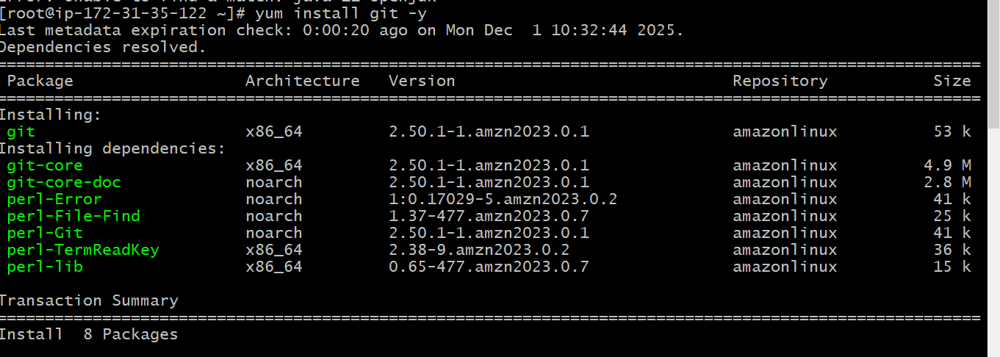 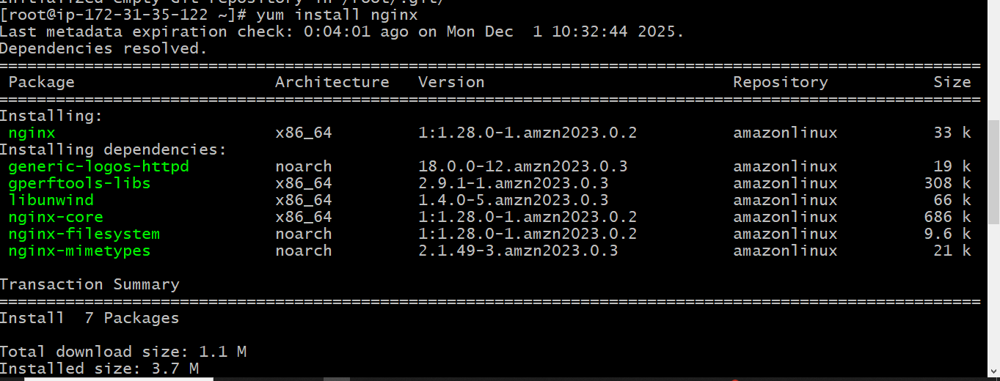 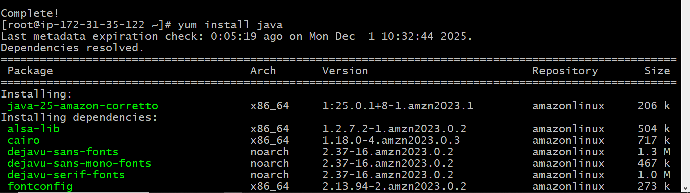

---

### 4️⃣ Check System Information

```bash
# Memory
free -h

# CPU
lscpu

# Disk
df -h
lsblk

# OS Details
uname -a
cat /etc/os-release
```
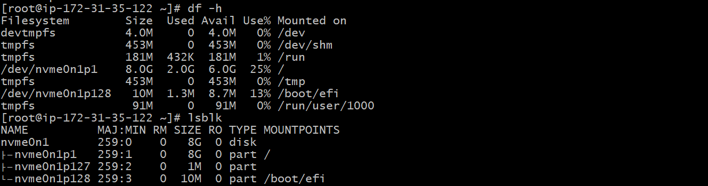 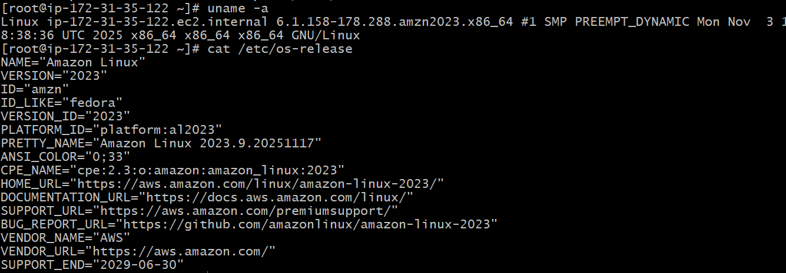
---

# 🟡 Level 2 – Intermediate (Daily DevOps Tasks)

### 5️⃣ Automate Backups with Cron

```bash
# Edit cron jobs
crontab -e

# Add this line to run backup daily at 1 AM
0 1 * * * tar -czf /backup/app_backup_$(date +\%F).tar.gz /projects/app1
```
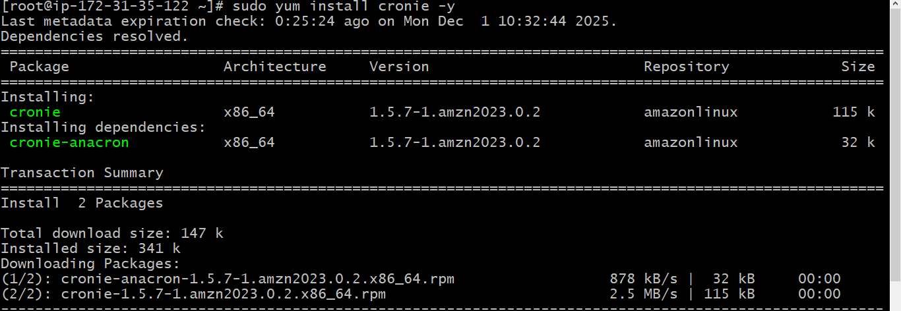 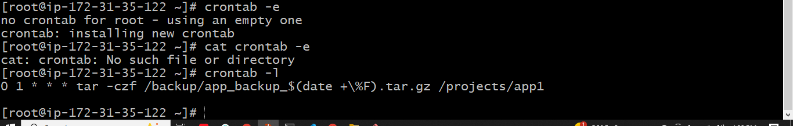
---

### 6️⃣ Shell Scripts: Log Cleanup, Service Restart, Health Check

📄 log_cleanup.sh

```bash
#!/bin/bash
find /var/log -name "*.log" -type f -mtime +7 -delete
```
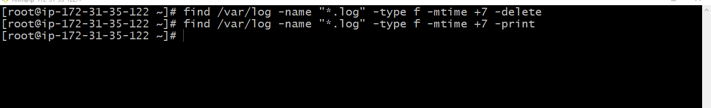

📄 restart_service.sh

```bash
#!/bin/bash
sudo systemctl restart nginx
sudo systemctl restart sshd
```
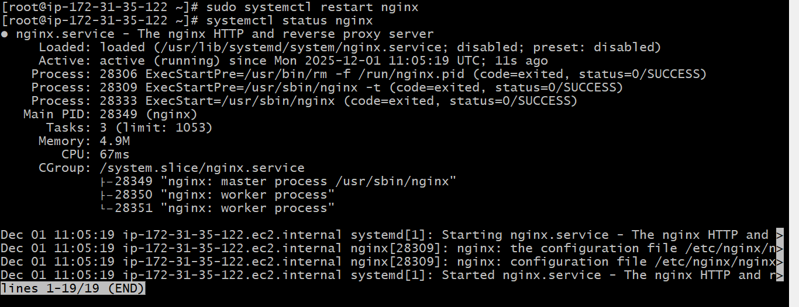 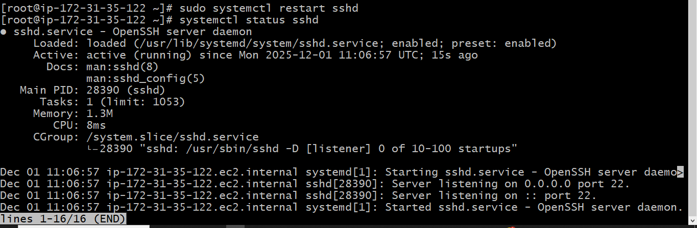

📄 health_check.sh

```bash
#!/bin/bash
curl -I http://localhost || echo "Service is down"
```
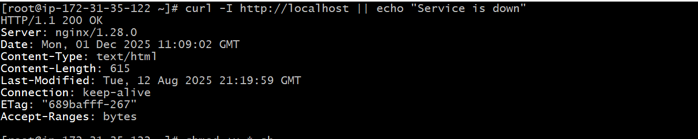
```bash
chmod +x *.sh
```
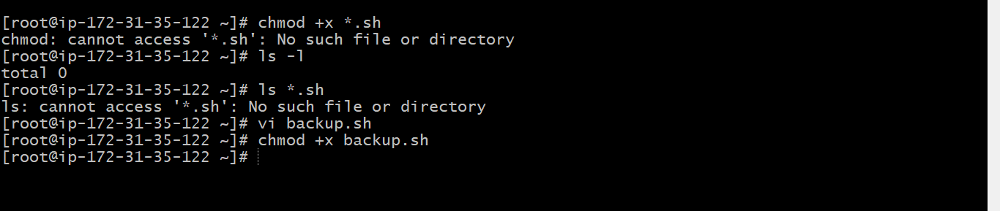

---

### 7️⃣ Manage Logs Under `/var/log`

```bash
cd /var/log
sudo ls -l
sudo journalctl -f
sudo tail -f nginx/access.log
sudo journalctl (it will show uh entire logs)

```
[text](README.md) 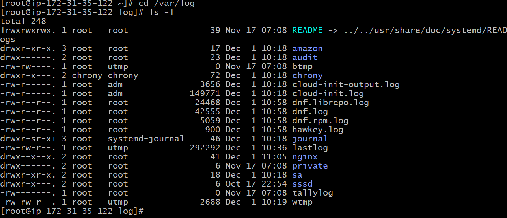 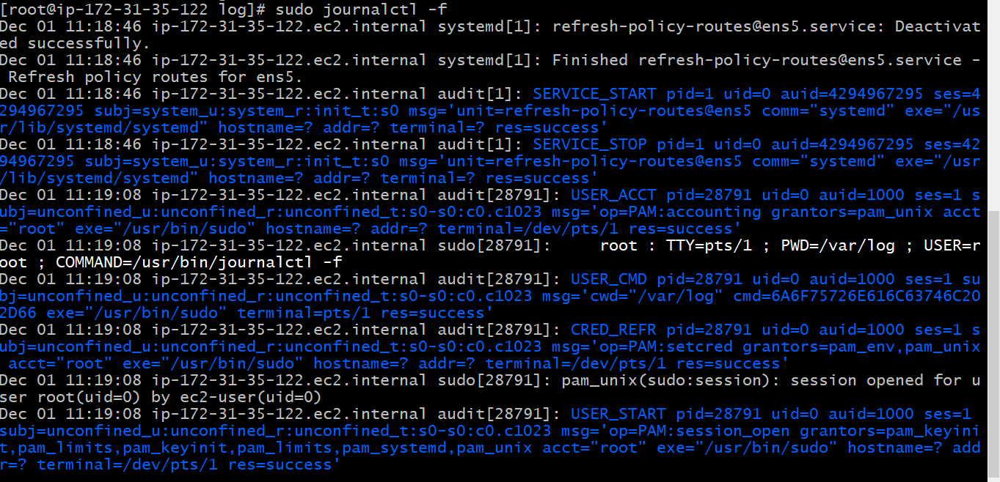 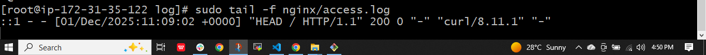 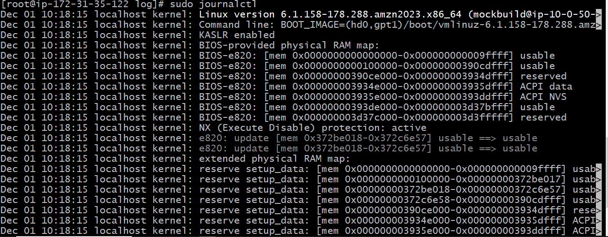
---

### 8️⃣ Monitor System Performance & Troubleshoot

```bash
# Live performance monitoring
top
htop    # If installed

evidence/8-1.png evidence/8-2.png

# Check running services
systemctl status nginx
journalctl -xe  | head

evidence/8-3.png evidence/8-4.png

# Check network
netstat -tulnp   # or ss -tulnp
```
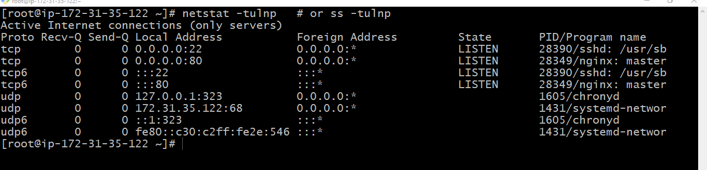
---

# 🔴 Level 3 – Advanced (Production-Ready Linux Admin)

### 9️⃣ Create Custom Systemd Service

📄 `/etc/systemd/system/myapp.service`

```ini
[Unit]
Description=My Sample App
After=network.target

[Service]
ExecStart=/usr/bin/python3 /projects/app1/app.py
Restart=always
User=alice

[Install]
WantedBy=multi-user.target
```

```bash
sudo systemctl daemon-reload
sudo systemctl enable myapp
sudo systemctl start myapp
sudo systemctl status myapp
```
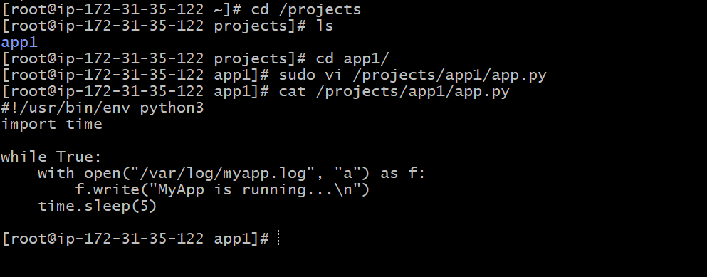 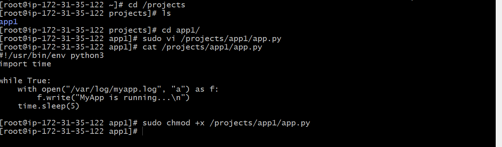 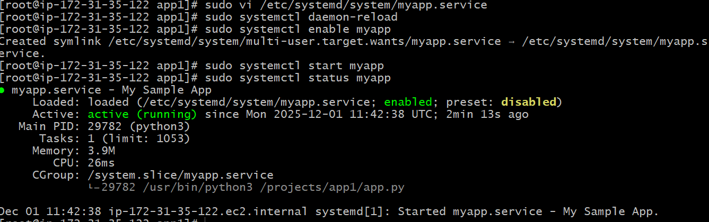
---

### 🔟 SSH Hardening

```bash
sudo vi /etc/ssh/sshd_config
```

Change these:

```
PermitRootLogin no
PasswordAuthentication no
AllowUsers alice bob
```

```bash
sudo systemctl restart sshd
```
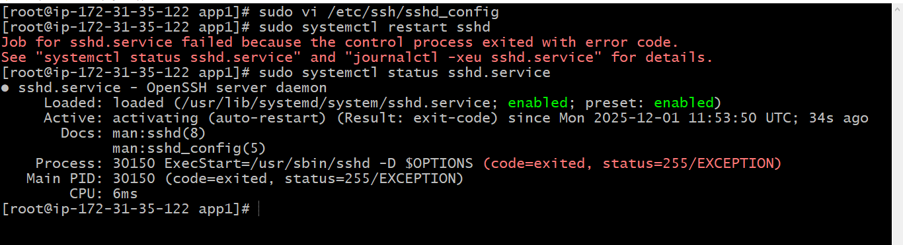
---

### 1️⃣1️⃣ LVM Setup for Storage Scaling

```bash
# Identify disk
lsblk

evidence/11-1.png

# Create Physical Volume
sudo pvcreate /dev/xvdb

evidence/11-2.png

# Create Volume Group
sudo vgcreate myvg /dev/xvdb
evidence/11-3.png
# Create Logical Volume
sudo lvcreate -L 5G -n mylv myvg

# Format and mount
sudo mkfs.ext4 /dev/myvg/mylv
sudo mount /dev/myvg/mylv /mnt
```

---

### 1️⃣2️⃣ Configure Firewall

```bash
# For Amazon Linux / RHEL / CentOS
sudo dnf install firewalld -y
evidence/12-1.png

sudo systemctl enable firewalld
sudo systemctl start firewalld

evidence/12-2.png


# Now you can add firewall rules
sudo firewall-cmd --add-service=http --permanent
sudo firewall-cmd --add-service=https --permanent
sudo firewall-cmd --add-service=ssh --permanent
sudo firewall-cmd --reload

evidence/123.png

```

---

### 1️⃣3️⃣ Implement Logrotate for App Logs

📄 `/etc/logrotate.d/myapp`

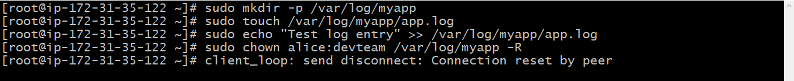

```ini
/var/log/myapp/*.log {
    daily
    rotate 7
    compress
    missingok
    notifempty
    create 0640 alice devteam
    postrotate
        systemctl restart myapp
    endscript
}
```

```bash
sudo logrotate -f /etc/logrotate.d/myapp
```

---


